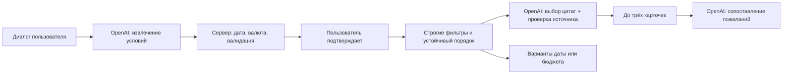

# Firebird · VibeOps

## Что реализовано
- AI-диалог для сбора требований
- поиск подрядчиков по каталогу
- проверка бюджета / даты / языка / категории
- до 3 рекомендаций
- объяснения с цитатами
- alternative date / budget
- валюты USD/EUR/RUB → KZT
- fallback без AI

## Как это работает
1. Пользователь описывает мероприятие
2. AI извлекает параметры
3. Пользователь подтверждает
4. Backend фильтрует каталог
5. AI объясняет найденные варианты
6. Пользователь получает до 3 карточек

AI-помощник для выбора event-подрядчиков. Пользователь описывает мероприятие, уточняет условия и получает до трёх подходящих профилей с конкретными основаниями выбора. Прототип для кейса HackAlem AI **#79-lite «Умный подбор подрядчиков»**.

**Основной сценарий:** пожелание → уточнение → подтверждение условий → проверка каталога → карточки → сопоставление пожеланий с цитатами. Если подходящих мало, можно явно применить предложенную дату или бюджет и повторить поиск.

## Самостоятельный запуск

Требуются **Node.js 24 LTS и npm**. Node 22.12+ также соответствует основным требованиям проекта; итоговые проверки выполнялись на Node 24. Версии библиотек закреплены в `package-lock.json`. Команды выполнять из корня репозитория:

```bash
git clone https://github.com/BAITC-Hacks/hack-4a3a9b1c-vibeops.git
cd hack-4a3a9b1c-vibeops
npm ci
cp .env.example .env
# Для AI заполните OPENAI_API_KEY и OPENAI_MODEL в .env до запуска сервера.
npm run build
npm start
```

Откройте **http://localhost:3000**. Для закрытого репозитория требуется предоставленный организатором доступ. Если каталог уже скачан архивом, начните с `npm ci`.

Для полного AI-сценария заполните локальный `.env`:

```dotenv
PORT=3000
DATASET_PATH=data/vendors.csv
OPENAI_API_KEY=
OPENAI_MODEL=gpt-4.1-mini
```

`OPENAI_API_KEY` — реальный серверный ключ с доступом к выбранной модели и Responses API. Он не входит в репозиторий, архивы релиза или клиентскую сборку. При запуске production сервер загружает `.env` сам. **После изменения ключа или модели остановите сервер и снова выполните `npm start`.** Переменные среды имеют приоритет. Никогда не используйте клиентский `VITE_*` для ключей.

**Без ключа** работают каталог, ручная форма, фильтры, альтернативы и объяснения из данных (`fallback`). AI-помощник честно сообщает об отсутствии доступа. **Для проверки именно AI** экспертам нужен заранее настроенный сервер либо ключ, переданный через согласованный с организаторами закрытый канал. Публичная демо-ссылка и доступ жюри не считаются предоставленными самим наличием репозитория; это организационный пункт [чек-листа сдачи](docs/RELEASE-CHECKLIST.md).

Если порт занят: задайте другой `PORT` для production-запуска, например `PORT=3010 npm start`. Данные ищутся относительно корня запуска. Ошибка загрузки CSV видна через `GET /api/health` как 503, а не как пустой рабочий каталог.

**Перед `npm run dev` остановите ранее запущенный backend или `npm start` на порту 3000.** Обновление файлов и `npm run build` не перезапускают старый процесс.

Разработка: `npm run dev` запускает React на http://localhost:5173 и Express на http://localhost:3000. Vite проксирует `/api` на 3000; для стандартного dev-режима оставьте этот порт. Production раздаёт UI и API одним Express-процессом.

## Повторить основной сценарий

1. Напишите: **«Нужен ведущий на корпоратив в Алматы»**. Помощник спросит дату и бюджет.
2. Уточните: **«10 октября 2026 года, до 1 миллиона тенге за ведущего, на русском, на 5 часов. Хочу юмор, танцы и программу без долгих речей»**.
3. Проверьте показанные условия и нажмите **«Подобрать по этим условиям»**. До подтверждения поиск не выполняется.
4. Посмотрите карточки: почему профиль прошёл фильтры, цитата из его описания, какие пожелания подтверждаются описанием и что нужно уточнить.
5. Исправьте в диалоге дату или бюджет и подтвердите новые условия. Ручная форма также доступна.
6. Если показано предложение другой даты/бюджета, примените его отдельной кнопкой. Остальные условия сохраняются; старое сравнение пожеланий заменяется новым.

Естественный ввод: **«Нужен ведущий на свадьбу в Алматы послезавтра, бюджет 500 долларов»**. Сервер вычисляет дату по `Asia/Almaty` и сумму в тенге по справочному курсу НБК. Перед поиском видны точная дата, приблизительная сумма, исходная валюта, курс и его дата. На 23.09.2026 пример означает 25.09.2026 и примерно 223 925 ₸. При запуске в другой день дата/курс могут отличаться. Известный календарь каталога ограничен 23.09–31.12.2026; за его пределами приложение требует другую дату, не обещая неизвестную доступность.

«100 гостей» не является бюджетом. Неоднозначные суммы, неподдерживаемая валюта или недоступный актуальный курс требуют уточнения. Поддержаны USD, EUR и RUB; курс — ориентир, а не банковское предложение обмена. [Официальный источник НБК](https://nationalbank.kz/ru/page/RSS): один ограниченный по времени запрос, кэш, датированный снимок от 23.09.2026 на случай отказа сервиса. Снимок/курс старше семи дней не используется; источник и дата всегда показываются.

## Проверка по готовым примерам

Кнопки D1–D6 отправляют настоящие запросы к каталогу; это не заранее записанные ответы. В таблице часы и язык не заданы.

| Пример | Условия | Ожидаемый результат |
|---|---|---|
| D1 | Алматы, ведущий, корпоратив, 10.10.2026, 1 млн ₸ | 4 подходят, показаны первые 3 |
| D2 | D1, дата 11.10.2026 | Другой состав: HK-88430 занят; HK-44733 доступен по каталогу |
| D3 | Алматы, флорист, свадьба, 10.10.2026, 500 тыс. ₸ | 1 профиль HK-39372; возможна альтернатива даты |
| D4 | Астана, декоратор, свадьба, 10.10.2026, 500 тыс. ₸ | Категории нет в городе (`no_category_in_city`) |
| D5 | D1, бюджет 1 ₸ | Никто не подходит (`no_matches`); возможна альтернатива бюджета |
| D6 | Алматы, банкетный зал, свадьба, 14.11.2026, 5 млн ₸ | 2 профиля HK-64395, HK-90011 |

Пустой результат объясняет ограничения. Причины исключения считаются независимо, поэтому один профиль может попасть в несколько счётчиков.

## Архитектура и роль AI



- **Клиент:** React + TypeScript + Vite. Диалог, ручная форма, подтверждение, карточки, альтернативы, независимые состояния ошибок поиска и AI-сравнения.
- **Сервер:** Node.js + Express + TypeScript. Валидация, загрузка CSV, календарь, фильтры, ранжирование, проверка ответов AI, серверная арифметика валют/дат.
- **Данные:** один неизменённый CSV организатора. Базы данных и обучения модели нет.
- **Продуктовый AI:** OpenAI Responses API, по умолчанию `gpt-4.1-mini`; структурированный ответ, `store:false`, без автоматических повторов. Модель извлекает условия и выбирает свидетельства; цены, календарь, ID и порядок контролирует код.
- **Устойчивость:** объяснения — таймаут 6 секунд и ограниченный кэш; brief/compare — отдельные таймауты. При отказе объяснений включается помеченный fallback. При отказе compare уже найденные карточки сохраняются. Ошибки brief/compare не выдаются за успешную работу модели.

Ранжирование v1 — число совпавших групп маркеров формата в описании, затем меньшая стартовая цена, затем ASCII ID. Это **лексическая эвристика**, не обученная семантическая оценка качества подрядчика. LLM не переставляет карточки.

Объяснения v5 выбирают свидетельства совместно для всей выдачи и предпочитают факты, отличающие соседние профили. Если описание не содержит отдельного отличия, это прямо сказано. Сравнение пожеланий использует проверяемые полные фрагменты своего профиля; отсутствие основания остаётся в «Нужно уточнить». Проверка источника цитаты не является независимой проверкой её истинности или безошибочности смысловой интерпретации.

Альтернативы меняют ровно одно условие: ближайшую полезную дату в пределах ±7 дней либо минимальный увеличенный бюджет, добавляющий подходящих кандидатов. Фильтры языка/часов/формата сохраняются. Это расчёт по каталогу; без явного клика условия не ослабляются.

### API

| Метод и путь | Назначение |
|---|---|
| `GET /api/health` | Доступность каталога, число профилей, наличие AI-конфигурации; наличие конфигурации не доказывает успешный API-вызов |
| `GET /api/options` | Города, категории, форматы, языки, границы дат |
| `POST /api/assistant/brief` | `{messages: string[]}` → черновик, вопросы, предупреждения и готовый `query` либо `null` |
| `POST /api/recommend` | `Query` → три исхода, 0–3 карточки, причины исключения, AI-источники и `decision_support` |
| `POST /api/assistant/compare` | `{query, preferences}` → цитаты по пожеланиям либо вопросы к подрядчику |

Точные типы: [contracts.ts](shared/contracts.ts), [assistant.ts](shared/assistant.ts), [decision-support.ts](shared/decision-support.ts). Диалог ограничен 8 сообщениями, 2000 символами на реплику и 8000 суммарно; до пяти пожеланий. Поиск поддерживает один город, дату, категорию, формат и один язык за раз. Несколько обязательных языков требуют уточнения, а не молчаливого удаления требования.

## Данные и ограничения

66 профилей, 17 категорий. SHA-256 `data/vendors.csv`: `6a724b6b7dfb5973343e68ba18dadb60fc807d87e3d78f03ee86fb26cb089f7d` — исходные байты организатора. [Происхождение данных](data/README.md).

- Цена **«от»** за мероприятие — не окончательная смета. Итоговую цену нужно согласовать.
- Дата без отметки занятости — не подтверждённая бронь. Площадки проверяются по календарю так же, как остальные подрядчики.
- `max_hours=null` означает неприменимость ограничения часов. Synthetic/city_imputed/price_imputed видимы в карточках.
- Два скудных описания могут не дать содержательной цитаты; факты не выдумываются. Длинный фрагмент, который нельзя безопасно сократить, может остаться неподтверждённым пожеланием.
- Описания и запросы являются недоверенными данными, не инструкциями для программы. Для AI во внешний сервис передаются запрос и нужные анонимизированные описания; секреты остаются на сервере.
- Модель не обучается на 66 профилях. NVIDIA API не подключён. Резервирование, платежи, обновление календарей поставщиками и мультикатегорийная смета не реализованы.

## Автоматические и живые проверки

```bash
npm run typecheck
npm test
npm run test:ui
npm run build
npm audit --omit=dev
node --import tsx tests/explanations/catalog-evidence-audit.ts --run
```

Эти тесты не требуют ключа. Фикстуры и подставные провайдеры используются только в тестах; они не заменяют настоящую AI-проверку.

Для работающего сервера:

```bash
node tests/ui/acceptance.mjs http://127.0.0.1:3000
node --import tsx tests/explanations/decision-live.ts --run http://127.0.0.1:3000
```

С настроенным серверным ключом (расходует API-кредиты):

```bash
node --import tsx tests/explanations/assistant-live.ts --live
node --import tsx tests/explanations/natural-language-live.mjs --live http://127.0.0.1:3000
node --import tsx tests/explanations/decision-live.ts --run --require-ai http://127.0.0.1:3000
```

Текущие результаты, точная версия, задержки и ограничения собраны в [отчёте релиза](docs/release-acceptance.md). Старые `ai-notes`, `ui-notes` и отчёты сохранены как история; их прежние числа тестов не являются статусом новой версии. Ни один одиночный замер не является SLA; нулевые повторы текста не доказывают смысловое качество всех возможных запросов.

## Соответствие кейсу и положению

По переданному ТЗ этого кейса применяется шкала **25 / 25 / 25 / 15 / 10**. Подробности и исходные требования: [пакет кейса](docs/FIREBIRD-CODEX-PACK.md). Это карта доказательств, не самооценка баллов.

| Критерий | Что можно проверить |
|---|---|
| Соответствие задаче и работоспособность — 25 | Все входы, календарь, до трёх карточек, три исхода, D1–D6, объяснения |
| Техническая реализация — 25 | Настоящие AI-вызовы, строгие контракты, источники цитат, устойчивый порядок, ошибки/таймауты |
| README и воспроизводимость — 25 | Команды чистого запуска, env, данные, архитектура, тесты и явные ограничения |
| Ценность и применимость — 15 | Сокращение каталога, уточнение потребности, сопоставление пожеланий, понятные альтернативы |
| Потенциал и оригинальность — 10 | Сочетание проверяемых свидетельств, диалога и контролируемого изменения одного условия |

README покрывает назначение, архитектуру, технологии, зависимости, установку, запуск, окружение и проверку сценария из п. 5.4.15 предоставленного положения. Самостоятельный запуск и разрешённый доступ экспертов проверяются отдельно. Итоговая версия фиксируется до 18:00 23.09.2026; изменения после окончания не выдаются за сданную версию. GitHub Release/push не заменяет действие «Сдать решение» на платформе.

## Источники, инструменты и развитие

Основная функциональность разработана во время хакатона; история в официальном репозитории сохранена. До старта подготовлены правила работы и контекст. Старый тренировочный продукт не используется. Для разработки применялся Codex; это отдельно от продуктовых вызовов OpenAI API.

Сторонние компоненты: Node.js, TypeScript, Express, React, Vite/Vitest, csv-parse, dotenv и OpenAI SDK; лицензии поставляются с пакетами в `node_modules`, точные версии — в lockfile. Каталог предоставлен организатором для кейса; открытая лицензия на него не заявляется. Курсы — публичный справочник Национального Банка Казахстана с указанием даты и источника.

После хакатона возможны интеграции актуальных календарей/цен, оценка качества рекомендаций на размеченной выборке, поддержка нескольких подрядчиков и языков в одном запросе. Это направления развития, не готовые функции.

[Ответственность команды и следующие задачи](docs/TEAM-NEXT-STEPS.md) · [Чек-лист сдачи](docs/RELEASE-CHECKLIST.md)
